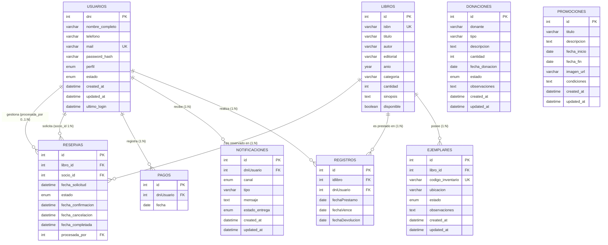

# Documentación de Base de Datos - Biblioteca Virtual

Base de datos relacional para el sistema de gestión de la **Biblioteca Virtual** (`biblioteca_virtual`).

---

## 1. Diagrama Entidad-Relación (DER)

---

## 2. Diccionario de Tablas y Relaciones

### 2.1 `usuarios`
Gestiona la información de socios y administradores/bibliotecarios.
- **`dni`** (`INT`): Identificador único (Clave Primaria, rango entre 1.000.000 y 99.999.999).
- **`nombre_completo`** (`VARCHAR(150)`): Nombre y apellido del usuario.
- **`telefono`** (`VARCHAR(30)`): Teléfono de contacto.
- **`mail`** (`VARCHAR(150)`): Correo electrónico (Único).
- **`password_hash`** (`VARCHAR(255)`): Contraseña cifrada.
- **`perfil`** (`ENUM('socio', 'bibliotecario')`): Rol en el sistema.
- **`estado`** (`ENUM('activo', 'suspendido')`): Estado de la cuenta.
- **`created_at`** (`DATETIME`): Fecha de creación.
- **`updated_at`** (`DATETIME`): Última modificación.
- **`ultimo_login`** (`DATETIME`): Fecha y hora del último inicio de sesión.

---

### 2.2 `libros`
Catálogo general de títulos bibliográficos disponibles.
- **`id`** (`INT AUTO_INCREMENT`): Clave Primaria.
- **`isbn`** (`VARCHAR(20)`): Código ISBN del libro (Único).
- **`titulo`** (`VARCHAR(255)`): Título de la obra.
- **`autor`** (`VARCHAR(150)`): Autor(es) de la obra.
- **`editorial`** (`VARCHAR(150)`): Editorial que publica.
- **`anio`** (`YEAR`): Año de publicación.
- **`categoria`** (`VARCHAR(100)`): Género o categoría literaria.
- **`cantidad`** (`INT`): Total de copias registradas ($\ge 0$).
- **`sinopsis`** (`TEXT`): Resumen descriptivo.
- **`disponible`** (`BOOLEAN`): Indicador de disponibilidad general.

---

### 2.3 `ejemplares`
Inventario de copias físicas individuales asociadas a cada libro.
- **`id`** (`INT AUTO_INCREMENT`): Clave Primaria.
- **`libro_id`** (`INT`): Clave Foránea a `libros(id)`.
- **`codigo_inventario`** (`VARCHAR(50)`): Código identificador físico (Único).
- **`ubicacion`** (`VARCHAR(100)`): Ubicación física (ej. estante, sala).
- **`estado`** (`ENUM('disponible', 'prestado', 'reservado', 'perdido', 'danado', 'baja')`): Estado de conservación/disponibilidad física.
- **`observaciones`** (`TEXT`): Notas adicionales.
- **`created_at`** / **`updated_at`** (`DATETIME`): Auditoría temporal.

---

### 2.4 `registros` (Préstamos)
Control del ciclo de vida de préstamos de libros a usuarios.
- **`id`** (`INT AUTO_INCREMENT`): Clave Primaria.
- **`idlibro`** (`INT`): Clave Foránea a `libros(id)`.
- **`dniUsuario`** (`INT`): Clave Foránea a `usuarios(dni)`.
- **`fechaPrestamo`** (`DATE`): Fecha en la que se otorga el préstamo.
- **`fechaVence`** (`DATE`): Fecha límite para devolución.
- **`fechaDevolucion`** (`DATE`): Fecha en que se efectuó la devolución (`NULL` si está en curso).

---

### 2.5 `reservas`
Gestión de solicitudes de reserva anticipada de libros.
- **`id`** (`INT AUTO_INCREMENT`): Clave Primaria.
- **`libro_id`** (`INT`): Clave Foránea a `libros(id)`.
- **`socio_id`** (`INT`): Clave Foránea a `usuarios(dni)` (socio solicitante).
- **`fecha_solicitud`** (`DATETIME`): Fecha y hora de solicitud.
- **`estado`** (`ENUM('pendiente', 'confirmada', 'cancelada', 'completada')`): Estado de la reserva.
- **`fecha_confirmacion`** (`DATETIME`): Fecha de confirmación.
- **`fecha_cancelacion`** (`DATETIME`): Fecha de cancelación.
- **`fecha_completada`** (`DATETIME`): Fecha en que se concretó la entrega.
- **`procesada_por`** (`INT`): Clave Foránea a `usuarios(dni)` (bibliotecario que gestionó).

---

### 2.6 `pagos`
Registro histórico de pagos de cuotas societarias o aranceles.
- **`id`** (`INT AUTO_INCREMENT`): Clave Primaria.
- **`dniUsuario`** (`INT`): Clave Foránea a `usuarios(dni)`.
- **`fecha`** (`DATE`): Fecha del pago.

---

### 2.7 `notificaciones`
Registro y cola de envíos de alertas a usuarios por distintos canales.
- **`id`** (`INT AUTO_INCREMENT`): Clave Primaria.
- **`dniUsuario`** (`INT`): Clave Foránea a `usuarios(dni)`.
- **`canal`** (`ENUM('telegram', 'whatsapp', 'email')`): Medio de comunicación.
- **`tipo`** (`VARCHAR(80)`): Categoría del aviso (ej. `vencimiento_proximo`, `prestamo_vencido`, `reserva_nueva`).
- **`mensaje`** (`TEXT`): Contenido del mensaje.
- **`estado_entrega`** (`ENUM('pendiente', 'enviado', 'fallido')`): Estado de entrega del mensaje.
- **`created_at`** / **`updated_at`** (`DATETIME`): Auditoría temporal.

---

### 2.8 `donaciones`
Registro de donaciones bibliográficas o materiales recibidas por la biblioteca.
- **`id`** (`INT AUTO_INCREMENT`): Clave Primaria.
- **`donante`** (`VARCHAR(150)`): Nombre de la persona o entidad donante.
- **`tipo`** (`VARCHAR(30)`): Tipo de donación.
- **`descripcion`** (`TEXT`): Detalle del material donado.
- **`cantidad`** (`INT`): Cantidad de elementos ($> 0$).
- **`fecha_donacion`** (`DATE`): Fecha de recepción.
- **`estado`** (`ENUM('recibida', 'pendiente', 'rechazada')`): Estado de la donación.
- **`observaciones`** (`TEXT`): Notas adicionales.

---

### 2.9 `promociones`
Campañas, novedades y promociones de lectura difundidas por la biblioteca.
- **`id`** (`INT AUTO_INCREMENT`): Clave Primaria.
- **`titulo`** (`VARCHAR(255)`): Título de la promoción/campaña.
- **`descripcion`** (`TEXT`): Descripción detallada.
- **`fecha_inicio`** (`DATE`): Fecha de inicio de vigencia.
- **`fecha_fin`** (`DATE`): Fecha de fin de vigencia.
- **`imagen_url`** (`VARCHAR(255)`): Ruta a la imagen promocional.
- **`condiciones`** (`TEXT`): Términos y condiciones aplicables.
